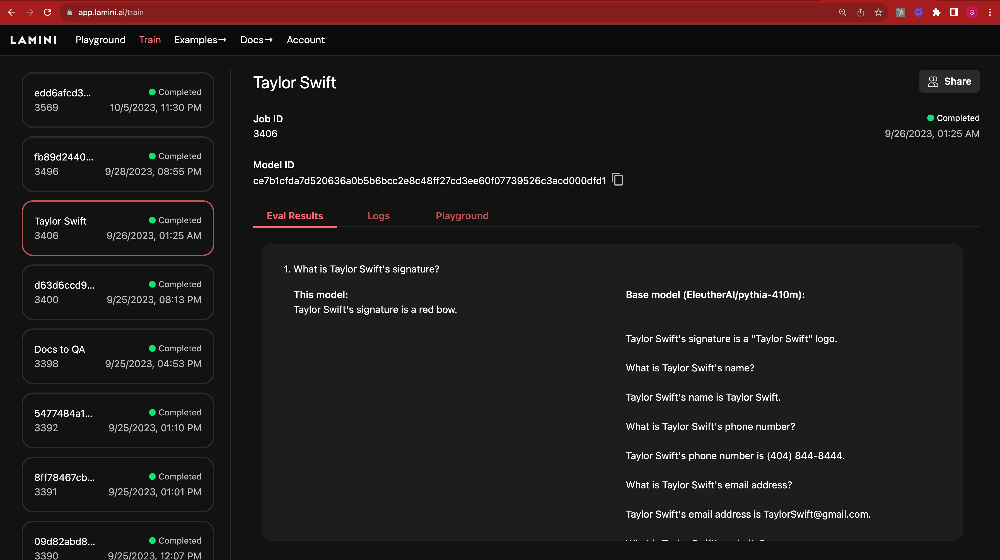

# Note tasks

## 1 QA_Generation

Change dir to QA_Generation

### LLM_prompting_pipeline_v1.py

No async using ChatFirework

### LLM_prompting_pipeline.py

Async using AzureChatOpenAI

Should change to ChatTogether

```python
from langchain_together import ChatTogether

llm = ChatTogether(
    model="meta-llama/Meta-Llama-3.1-70B-Instruct-Turbo",
    temperature=0.0,
    max_tokens=None,
    timeout=None,
    max_retries=2,
    # other params...
)
```

## 2 Fine-tuning

Change dir to finetuning

### langchain_lamini module

This is the simple code to run lamini in langchain

### 1-chatbot.py

This is simple use as chatbot

### 2-finetune.py

Should replace api key to trace training

```python
lamini.api="YOUR-API-KEY"
```

### 3-inference.py

should replace model_name to model id in lamini web

```python
llm = ChatLamini(model_name=model_id)
```

