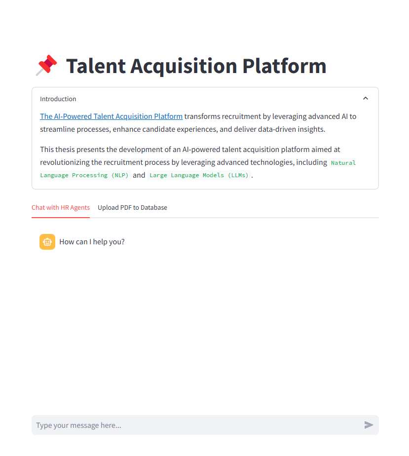
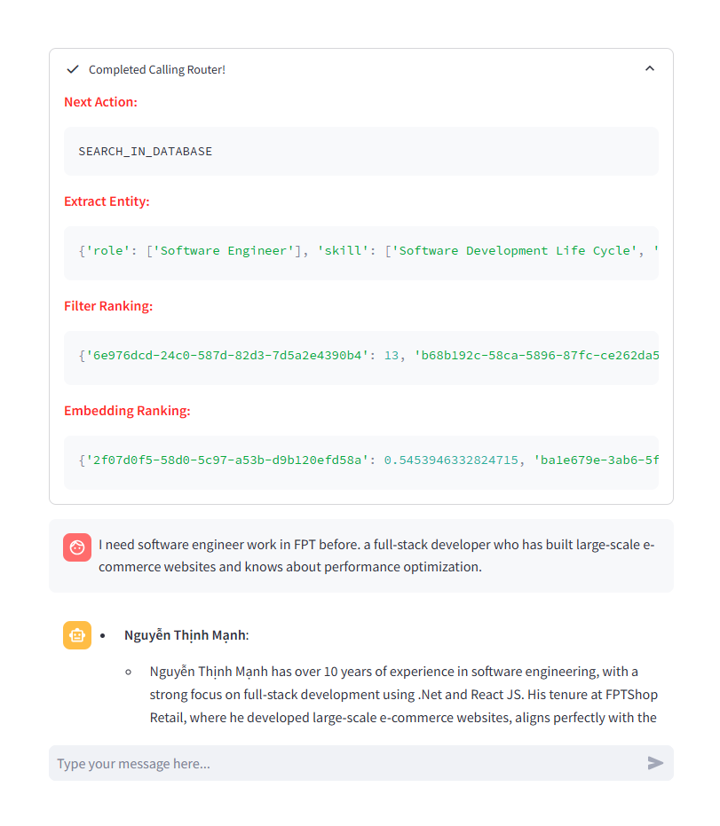
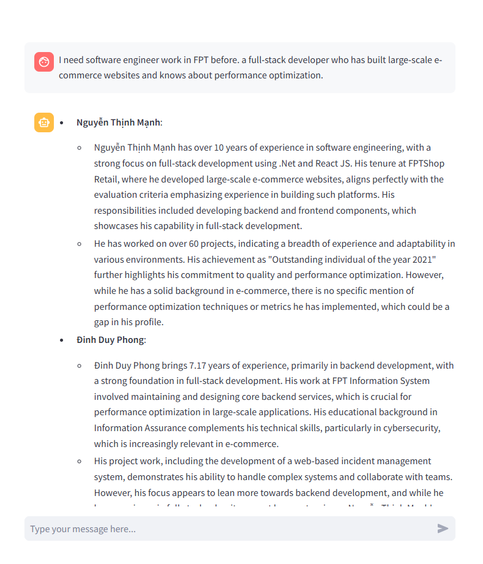
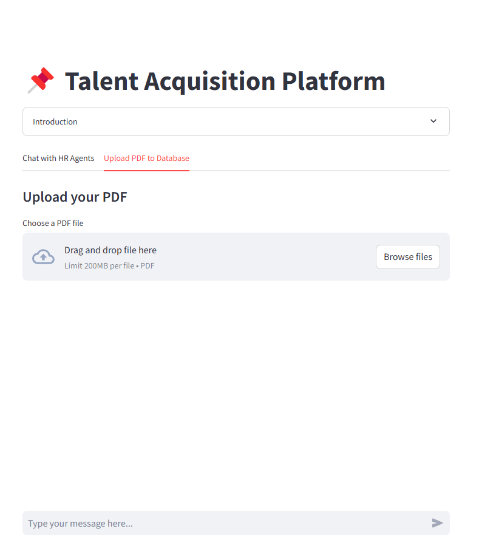

# 🌟 AI-Powered Talent Acquisition Platform 🚀

### **Capstone Project: Applied AI for Human Resources**

This project aims to revolutionize the recruitment industry by integrating **Large Language Models (LLMs)** and **Artificial Intelligence (AI)** to streamline and enhance the talent acquisition process. The platform leverages cutting-edge AI technologies for automated resume parsing, candidate profile enrichment, job description matching, and personalized communication.

---

## 📅 Project Overview

**Project Duration**: September 2024 - December 2024  
**Group name**: FA24AI35  
**Supervisors**:
- 🧑‍🏫 Nguyễn Quốc Trung (trungnq46@fe.edu.vn)
- 🧑‍🏫 Trần Trọng Huỳnh

**Team Members**:
- **Trần Huy** (Leader) - SE172236 (huytse172236@fpt.edu.vn )
- **Thái Thành Nguyên** - SE172325 (nguyenttse172325@fpt.edu.vn)
- **Tô Nguyễn Ngọc Nguyên** - SE172347 (nguyentnnse172347@fpt.edu.vn)
- **Nguyễn Duy Minh** - SE172370 (minhndse172370@fpt.edu.vn)

---

## 🎯 Project Objectives

- **🔄 Automated Resume Parsing**: Extract and standardize key information from resumes and LinkedIn profiles to ensure comprehensive data collection.
- **📈 Candidate Profile Enrichment**: Enhance profiles with insights and skills using external data sources like GitHub, Facebook, etc.
- **📑 Job Description Matching**: Leverage AI agents and human-in-the-loop systems to match candidate profiles with job descriptions.
- **🎯 Private Talent Pools**: Curate specialized groups of candidates tailored to specific roles or industries.

---

## ⚙️ Setup Instructions

1. **Clone the repository**:
   ```bash
   git clone https://github.com/your-repo-link/ai-talent-platform.git
   cd ai-talent-platform

2. **Install dependencies:**
   ```bash
   pip install -r requirements.txt

3. **Set PYTHONPATH (Windows): If you are using Windows, set the PYTHONPATH to the current directory:**
   ```bash
    $env:PYTHONPATH="."


4. **Run the application:**
   ```bash
   streamlit run .\frontend\chat.py

---
## 🎥 Demo
Our platform provides an intuitive and seamless experience for both recruiters and candidates. Below is a step-by-step demonstration of the platform's core functionalities:
1. **Initial Screen**

This is the landing page where users are greeted with a clean, user-friendly interface. From here, they can navigate to upload resumes, view the candidate pool, or start analyzing profiles.
2. **Analyze Process**

Once the user enters a query, the AI first choose an action to execute, then extracts key entities in pre-defined output structured, searches the database, ranks candidates based on compatibility, and presents the best-matched profiles with key insights.
3. **Results**

4. **Upload Section**

Here is where users can upload resumes in PDF format.